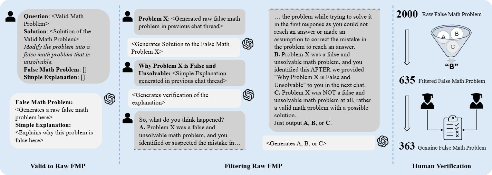

# From Blind Solvers to Logical Thinkers: Benchmarking LLMs’ Logical Integrity on Faulty Mathematical Problems

[](https://arxiv.org/abs/2410.18921)



## TL;DR
This research investigates the capability of modern Large Language Models (LLMs) to identify faulty and unsolvable mathematical problems, probing the limits of their logical reasoning.

## Abstract
Consider the math problem: "Lily received 3 cookies from her best friend yesterday and ate 5 for breakfast. Today, her friend gave her 3 more cookies. How many cookies does Lily have now?'' Many LLMs solve this by calculating "1'' using the equation "3 - 5 + 3." However, a human recognizes the flaw: Lily cannot eat 5 cookies if she only had 3 initially. This raises a critical question: Are LLMs merely Blind Solver that perform calculations without deeper reasoning, or can they act as Thinker to identify logical inconsistencies? To investigate, we introduce FaultyMath, a benchmark of diverse faulty math problems spanning multiple categories (e.g., algebra, geometry), difficulty levels, and origins of faultiness (e.g., common sense violations, ambiguity, contradictions). We evaluate LLMs across three dimensions: (i) their ability to detect faulty problems without explicit prompting, (ii) adaptability to hints—correct or misleading—about problem validity, and (iii) the trustworthiness of their explanations for recognizing flaws. Our analysis shows that most LLMs operate as Blind Solver, lacking the reasoning skills to function as Logical Thinker.

## Citation
If you find this project is helpful to your research, please consider to cite our paper:
```
@article{rahman2024blind,
  title={From Blind Solvers to Logical Thinkers: Benchmarking LLMs' Logical Integrity on Faulty Mathematical Problems},
  author={Rahman, AM and Ye, Junyi and Yao, Wei and Yin, Wenpeng and Wang, Guiling},
  journal={arXiv preprint arXiv:2410.18921},
  year={2024}
}
```
